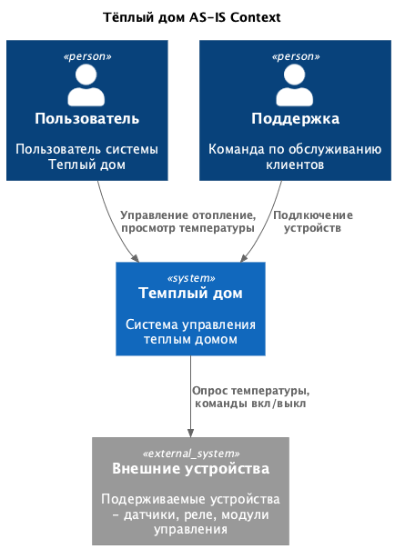
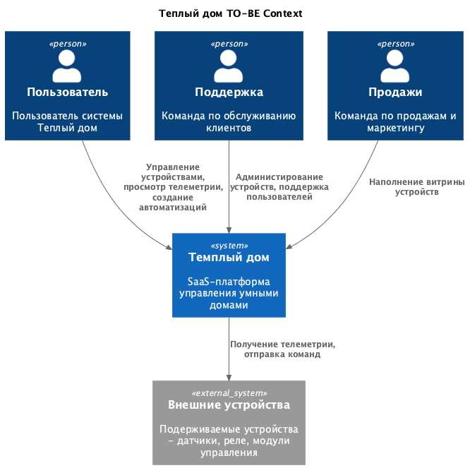
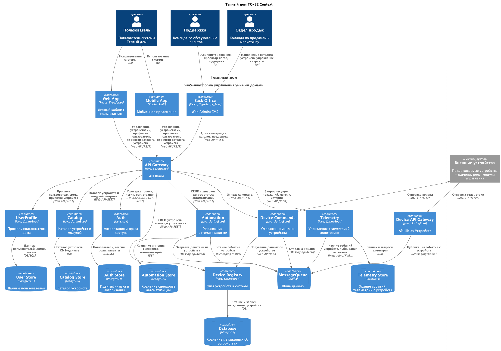
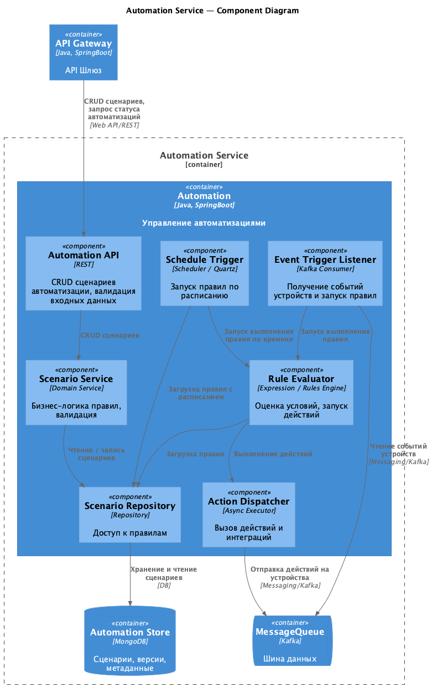
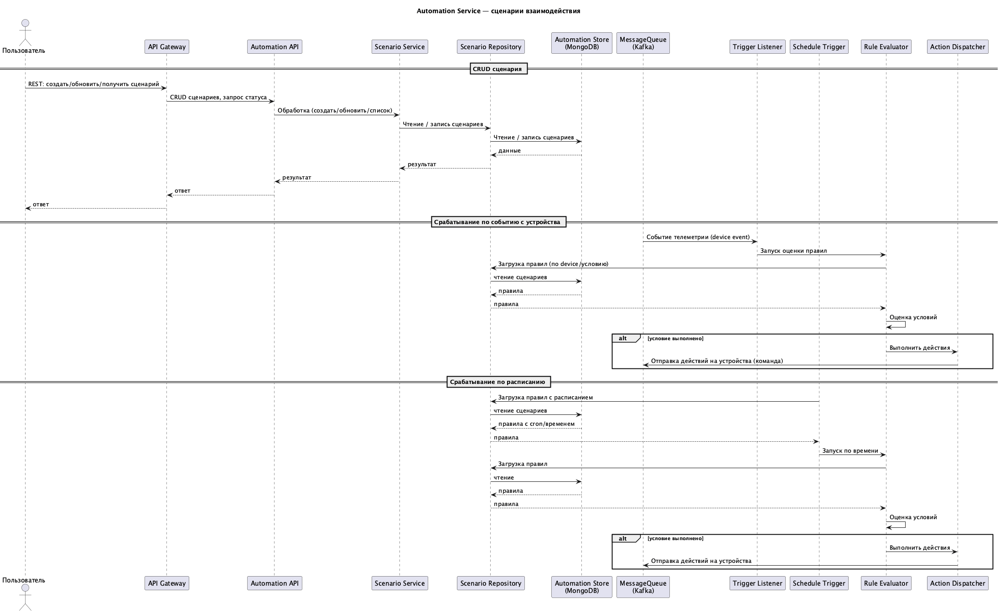
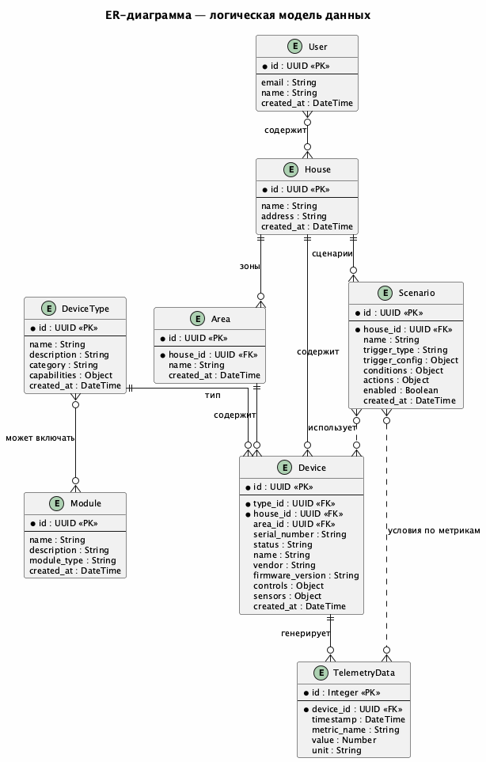
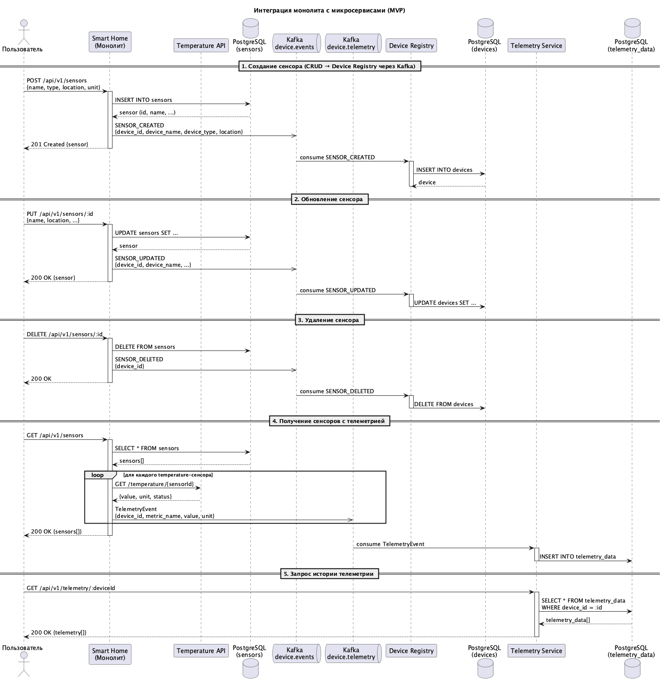

# Project_template

Это шаблон для решения проектной работы. Структура этого файла повторяет структуру заданий. Заполняйте его по мере работы над решением.

# Задание 1. Анализ и планирование


### 1. Описание функциональности монолитного приложения

**Управление отоплением:**

- Пользователи могут удалённо включать/выключать отопление в своих домах
  
**Мониторинг температуры:**

- Пользователи могут просматривать текущую температуру в своих домах через веб-интерфейс
- Система получает данные о температуре с датчиков, установленных в домах
  
**Подключение новых устройств:**

- Специалист по подключению выезжает на место и подключает новое устройство к системе
- Система регистрирует новое устройство


### 2. Анализ архитектуры монолитного приложения

- **Язык программирования:** Go
- **База данных:** PostgreSQL
- **Архитектура:** Монолитная, все компоненты системы (обработка запросов, бизнес-логика, работа с данными) находятся в рамках одного приложения.
- **Взаимодействие:** Синхронное, запросы обрабатываются последовательно.
- **Масштабируемость:** Ограничена, так как монолит сложно масштабировать по частям.
- **Развертывание:** Требует остановки всего приложения.

### 3. Определение доменов и границы контекстов

1. Домен - Управление Устройствами
   
	Контексты:
	- Управление устройствами (регистрация, активация, метаданные, отправка команд)
	- Управление телеметрией, мониторингом и логами (сбор и хранение событий с датчиков)
	- Управление сценариями автоматизаций (выполнение автоматизаций)	
	- Пользователи (профиль пользователя, дома)
	- Авторизация и права доступа


2. Домен - Дистрибуция устройств (Продвижение платформенных устройcтв и модулей, витрина) 
   Контексты:   
   - Каталог устройств и модулей (Витрина B2C / B2B, CMS)   


### **4. Проблемы монолитного решения**

- Трудно масштабировать систему при увеличении кол-ва устройств
- Отказ одной части системы, может привести к недоступности всей системы
- Высокий риск сбоев при внесении изменений
- Трудно тестировать все компоненты вместе
- Длительные циклы разработки и развертования
- Трудно масшатбировать команду
- Производительность страдает из-за тесной связи компонентов  


### 5. Визуализация контекста системы — диаграмма С4




# Задание 2. Проектирование микросервисной архитектуры


**Диаграмма контекста (Context)**



**Диаграмма контейнеров (Containers)**	

"Управление устройствами" выделен как отдельный контекст, но разбивается на 2 микросервиса:
- Device Registry 
- Devices Commands
 
чтобы иметь возможность независмо масштабировать Devices Commands под нагрузку (Scalability-based  decomposition)

API Gateway используется как реверс прокси для Авторизации, Rate limiting, TLS, базовой агрегации ответов и единого API для всех клиентов. Не содержит бизнесс логику и оптимизации под конкретные клиентсике устройства (view-model и тд. )




**Диаграмма компонентов (Components)**

Рассмотрим подробно один из ключевых компонентов системы, микросервис управления автоматизациями.
В задачи которого входит: сохраение и редактирование пользовательских сценариев, запуск автоматизаций на основе расписания
и по событиям изменения состояния от устройств. Для простоты будут реализованы только простые условия, например "включить свет в 19:00", "если температура < 18 → включить отопление" и тд. Промежуточное состояние будет храниться в памяти без возможности восстановления после падения.



**Диаграмма кода (Code)**

На диаграмме последовательности представлены основные сценарии создания и выполнения автоматизаций. 



# Задание 3. Разработка ER-диаграммы




# Задание 4. Создание и документирование API

### 1. Тип API

В системе используются два типа API:

**REST API (OpenAPI 3.0)** — для синхронного взаимодействия между микросервисами, когда клиенту необходим немедленный ответ:
- CRUD-операции с устройствами (Device Registry)
- Запросы телеметрии (Telemetry)
- Отправка команд на устройства (Device Commands)

REST выбран для этих сценариев, потому что клиент (Web App, Mobile App или другой микросервис через API Gateway) ожидает получить результат в рамках одного запроса — список устройств, показания датчиков или подтверждение приёма команды.

**Async API (Kafka)** — для асинхронного событийно-ориентированного взаимодействия и балансировки нагрузки:
- `device.telemetry` — поток событий телеметрии с устройств. Device API Gateway публикует, подписчики — Telemetry Service (запись в ClickHouse) и Automation Service (оценка правил).
- `device.commands` — поток команд управления устройствами. Публикуют Device Commands и Automation Service, подписчик — Device Commands (доставка на физическое устройство через MQTT/HTTPS).

Kafka выбран для этих сценариев, потому что:
- Телеметрия — высокочастотный поток данных, не требующий синхронного ответа; нескольким потребителям нужен доступ к одним и тем же событиям.
- Команды устройствам доставляются асинхронно — устройство может быть временно недоступно, и команда должна дождаться его в очереди.

### 2. Документация API

- **REST API (OpenAPI 3.0):** [api/openapi.yaml](api/openapi.yaml) | [Open in Swagger](https://editor.swagger.io/?url=https://raw.githubusercontent.com/jkurb/architecture-pro-warmhouse/refs/heads/warmhouse/api/openapi.yaml)
- **Async API (Kafka):** [api/asyncapi.yaml](api/asyncapi.yaml) | [Open in Asyncapi](https://studio.asyncapi.com/?url=https://editor.swagger.io/?url=https://raw.githubusercontent.com/jkurb/architecture-pro-warmhouse/refs/heads/warmhouse/api/asyncapi.yaml)

#### REST-эндпоинты

| Метод  | Эндпоинт                        | Микросервис      | Описание                          |
|--------|----------------------------------|------------------|-----------------------------------|
| GET    | `/devices`                       | Device Registry  | Список устройств дома             |
| POST   | `/devices`                       | Device Registry  | Регистрация нового устройства     |
| GET    | `/devices/{deviceId}`            | Device Registry  | Информация об устройстве          |
| PATCH  | `/devices/{deviceId}`            | Device Registry  | Обновление данных устройства      |
| GET    | `/devices/{deviceId}/telemetry`  | Telemetry        | Телеметрия устройства за период   |
| POST   | `/devices/{deviceId}/commands`   | Device Commands  | Отправка команды на устройство    |

#### Kafka-каналы

| Канал              | Продюсеры                        | Консьюмеры                         |
|--------------------|----------------------------------|-------------------------------------|
| `device.telemetry` | Device API Gateway               | Telemetry Service, Automation Service |
| `device.commands`  | Device Commands, Automation Service | Device Commands (доставка)        |

# Задание 5. Работа с docker и docker-compose

### Состав сервисов

| Сервис            | Технология             | Порт | Описание                                                  |
|-------------------|------------------------|------|-----------------------------------------------------------|
| `postgres`        | PostgreSQL 16 (Alpine) | 5432 | База данных, инициализируется скриптом `smart_home/init.sql` |
| `temperature-api` | Java 25, Spring Boot 3.5 | 8081 | Имитация удалённого датчика — возвращает случайную температуру |
| `app`             | Go 1.22, Gin           | 8080 | Smart Home API — управление датчиками                     |

### Как запустить

1. Убедитесь, что установлены **Docker** и **Docker Compose**.

2. Перейдите в директорию `apps/` и запустите скрипт инициализации:

```bash
cd apps
./init.sh
```

Скрипт автоматически:
- Соберёт и запустит все контейнеры (`docker-compose up --build -d`)
- Дождётся готовности PostgreSQL (healthcheck)
- Выведет информацию о доступности API

### Как проверить

**1. Проверка temperature-api (порт 8081)**

Запрос температуры по локации — каждый вызов возвращает случайное значение:

```bash
curl "http://localhost:8081/temperature?location=Living%20Room"
```

Пример ответа:

```json
{
    "value": 22.3,
    "unit": "°C",
    "timestamp": "2026-02-15T22:42:40.520Z",
    "location": "Living Room",
    "status": "active",
    "sensor_id": "ext-living-room",
    "sensor_type": "temperature",
    "description": "Temperature reading for Living Room: 22.3°C"
}
```

**2. Проверка smart_home API (порт 8080)**

Health check:

```bash
curl http://localhost:8080/health
```

Создание температурного датчика (Create Sensor):

```bash
curl -X POST http://localhost:8080/api/v1/sensors \
  -H "Content-Type: application/json" \
  -d '{
    "name": "Living Room Temperature",
    "type": "temperature",
    "location": "Living Room",
    "unit": "°C"
  }'
```

Получение всех датчиков (Get All Sensors) — при каждом вызове значение температуры меняется:

```bash
curl http://localhost:8080/api/v1/sensors
```

При повторном вызове поле `value` будет отличаться, так как `smart_home` запрашивает актуальные данные из `temperature-api`.


### Остановка сервисов

```bash
docker-compose down
```

Для удаления данных PostgreSQL:

```bash
docker-compose down -v
```


# Задание 6. Разработка MVP

### Архитектура


### Диаграмма последовательности интеграции с монолитом

Интеграция с монолитом происходит через асинхронные события, которые пробрасываются через Kafka в соответсвуйющие сервисы
- CRUD операции в device-registry
- Получение температруры в telemetry-service

После обновления всех клиентсих приложений на новое API, можно будет удалить монолит. 



Исходник PlantUML: [schemas/TOBE/Sequence_MVP.puml](schemas/TOBE/Sequence_MVP.puml)


Созданы два новых микросервиса, интегрированных с существующим монолитом через Kafka:

| Сервис | Язык/Фреймворк | Порт | Описание |
|--------|----------------|------|----------|
| `smart_home` (монолит) | Go 1.22, Gin | 8080 | Sensor CRUD + Kafka-продюсер (телеметрия и события устройств) |
| `temperature-api` | Java 25, Spring Boot 3.5 | 8081 | Генерация случайной температуры |
| `device-registry` | Java 25, Spring Boot 3.5 | 8082 | CRUD устройств + Kafka-консьюмер событий сенсоров + продюсер событий устройств |
| `telemetry-service` | Java 25, Spring Boot 3.5 | 8083 | Хранение/выдача телеметрии + Kafka-консьюмер |
| PostgreSQL | - | 5432 | Общая БД (sensors, devices, telemetry_data) |
| Kafka | Confluent 7.6 | 9092 | Брокер сообщений |

**Kafka-топики:**
- `device.events` -- монолит публикует события при CRUD-операциях над сенсорами (`SENSOR_CREATED`, `SENSOR_UPDATED`, `SENSOR_DELETED`); Device Registry потребляет и синхронизирует таблицу `devices`. Device Registry также публикует собственные события (`DEVICE_CREATED`, `DEVICE_UPDATED`, `DEVICE_DELETED`) при прямых операциях через REST.
- `device.telemetry` -- монолит публикует данные телеметрии при получении температуры с внешнего API; Telemetry Service потребляет и сохраняет в `telemetry_data`.


### Как проверить новые микросервисы

**Device Registry (порт 8082):**

Создать устройство:

```bash
curl -X POST http://localhost:8082/api/v1/devices \
  -H "Content-Type: application/json" \
  -d '{"name":"Thermostat","type":"thermostat","location":"Living Room","serialNumber":"TH-001"}'
```

Получить все устройства:

```bash
curl http://localhost:8082/api/v1/devices
```

**Telemetry Service (порт 8083):**

Сначала создать сенсор и запросить данные через монолит (это опубликует телеметрию в Kafka):

```bash
curl -X POST http://localhost:8080/api/v1/sensors \
  -H "Content-Type: application/json" \
  -d '{"name":"Room Temp","type":"temperature","location":"Room","unit":"°C"}'

curl http://localhost:8080/api/v1/sensors
```

Затем запросить историю телеметрии:

```bash
curl http://localhost:8083/api/v1/telemetry/1
```

Записать телеметрию вручную через REST:

```bash
curl -X POST http://localhost:8083/api/v1/telemetry \
  -H "Content-Type: application/json" \
  -d '{"deviceId":1,"metricName":"temperature","value":22.5,"unit":"°C"}'
```

